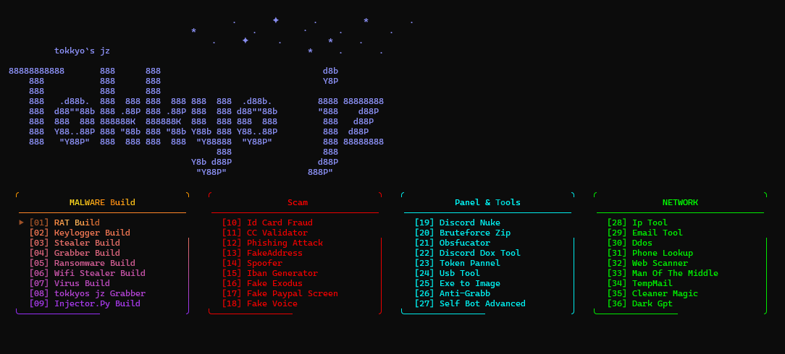

<!--
  ╔══════════════════════════════════════════════════════╗
  ║            TOKKYO`S JZ MULTI TOOL · COLORFUL         ║
  ╚══════════════════════════════════════════════════════╝
-->

  

  

  

